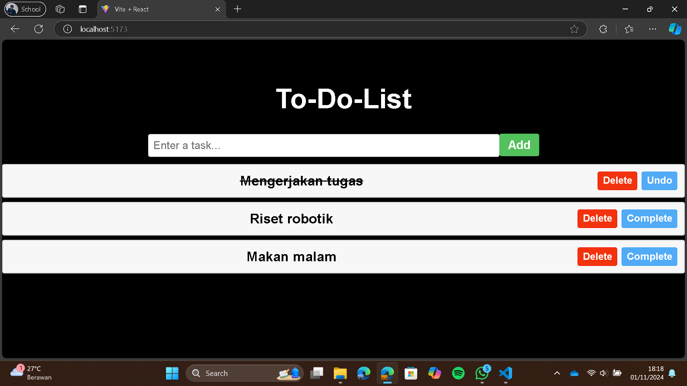

## Tugas Pengembangan Web_Muhammad Afiq Ramadhan Oktaviyanto_210601221020010

# Aplikasi Todo List Sederhana
Repositori ini berisi aplikasi Todo List sederhana yang dibuat dengan React. Aplikasi ini memungkinkan pengguna untuk menambah, menandai sebagai selesai, dan menghapus tugas. Aplikasi ini berfokus pada penggunaan state, props, dan komponen fungsional di React.

## Fitur
- Menambah Tugas: Pengguna dapat menambahkan tugas baru ke dalam Todo List.
- Menandai Tugas sebagai Selesai: Pengguna dapat menandai tugas sebagai selesai.
- Menghapus Tugas: Pengguna dapat menghapus tugas dari daftar.

## Environment yang Digunakan
- React: Library JavaScript untuk membangun antarmuka pengguna.
- CSS: Digunakan untuk menata tampilan layout Todo List.

## SCREENSHOTS

# React + Vite

This template provides a minimal setup to get React working in Vite with HMR and some ESLint rules.

Currently, two official plugins are available:

- [@vitejs/plugin-react](https://github.com/vitejs/vite-plugin-react/blob/main/packages/plugin-react/README.md) uses [Babel](https://babeljs.io/) for Fast Refresh
- [@vitejs/plugin-react-swc](https://github.com/vitejs/vite-plugin-react-swc) uses [SWC](https://swc.rs/) for Fast Refresh
